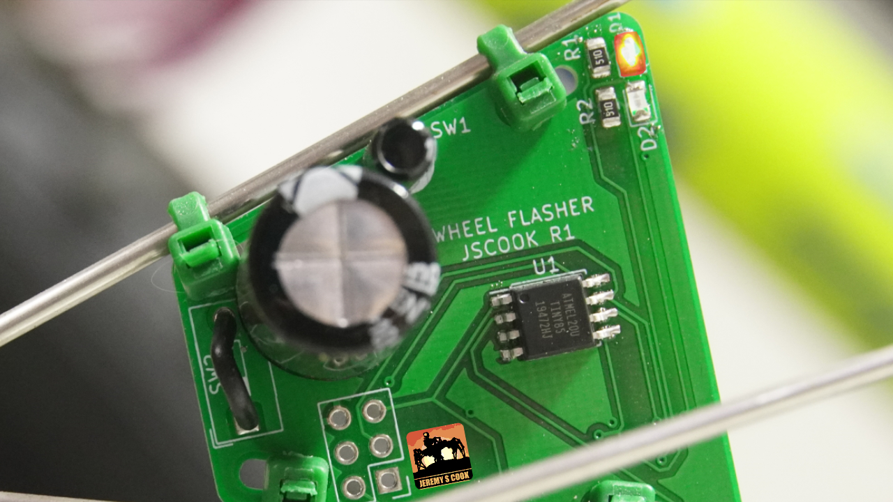

# ATtiny85-5LEDPCB
PCB with 5 LEDs, different blinking routines for each.

Manual version: https://www.youtube.com/watch?v=wJXMZybXftk

Auto Light-up Wheel light: https://www.youtube.com/watch?v=zVBrc78851Q

